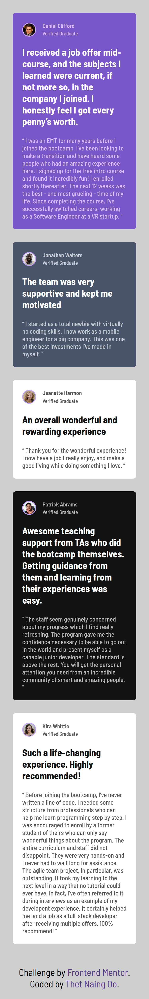
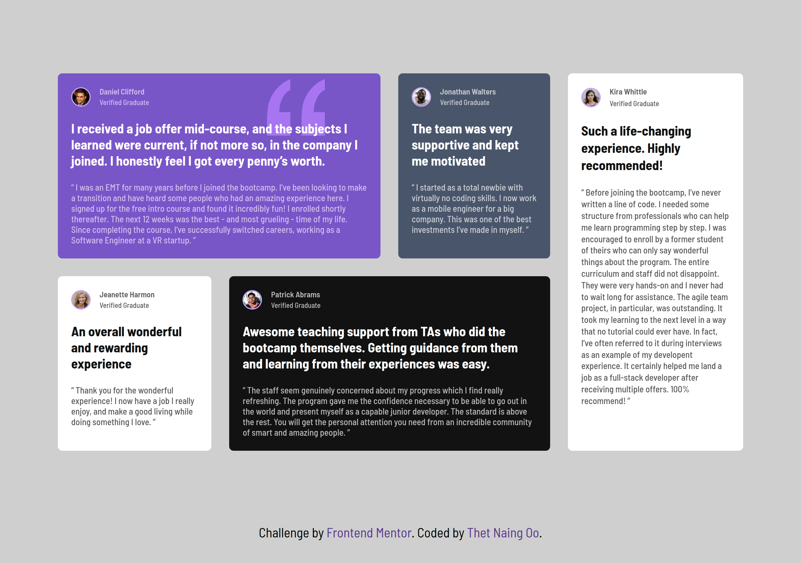

# Frontend Mentor - Testimonials grid section solution

This is a solution to the [Testimonials grid section challenge on Frontend Mentor](https://www.frontendmentor.io/challenges/testimonials-grid-section-Nnw6J7Un7). Frontend Mentor challenges help you improve your coding skills by building realistic projects. 

## Table of contents

- [Overview](#overview)
  - [The challenge](#the-challenge)
  - [Screenshot](#screenshot)
  - [Links](#links)
- [My process](#my-process)
  - [Built with](#built-with)
  - [What I learned](#what-i-learned)
  - [Continued development](#continued-development)
  - [Useful resources](#useful-resources)
  - [AI Collaboration](#ai-collaboration)
- [Author](#author)
- [Acknowledgments](#acknowledgments)

## Overview

### The challenge

Users should be able to:

- View the optimal layout for the site depending on their device's screen size

### Screenshot

### Mobile View


### Desktop View



### Links

- Solution URL: [Add solution URL here](https://github.com/Thet81/testimonials-grid-section)
- Live Site URL: [Add live site URL here](https://thet81.github.io/testimonials-grid-section/)

## My process
- I reset css and defined css custom properties. And then I started the layout using `css grid`.


### Built with

- Semantic HTML5 markup
- CSS custom properties
- Flexbox
- CSS Grid


### What I learned
- In this project, I have used both `css-grid` and `css-flex-box`.
- In this particular project I have to use background image property. 
- Positioning the background image is easy with css, I just have to tell where and how much the background image away from the particular direction I want just like this.

```css
  background-position: top 10px right 100px;
```

- In the above example, I was telling that I want the background image to be 10px from the top and 100px from the right.

### Continued development


### Useful resources


### AI Collaboration


## Author

- Frontend Mentor - [@yourusername](https://www.frontendmentor.io/profile/Thet81)


## Acknowledgments


